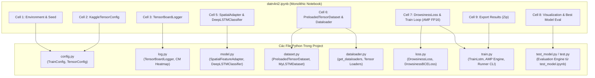
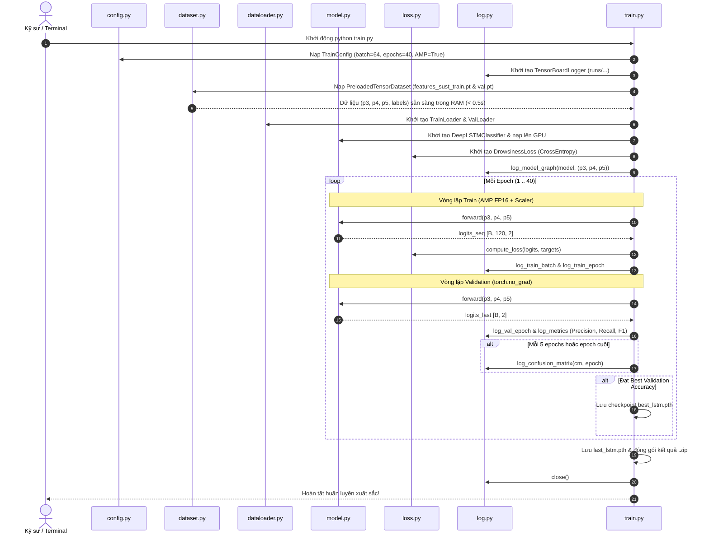
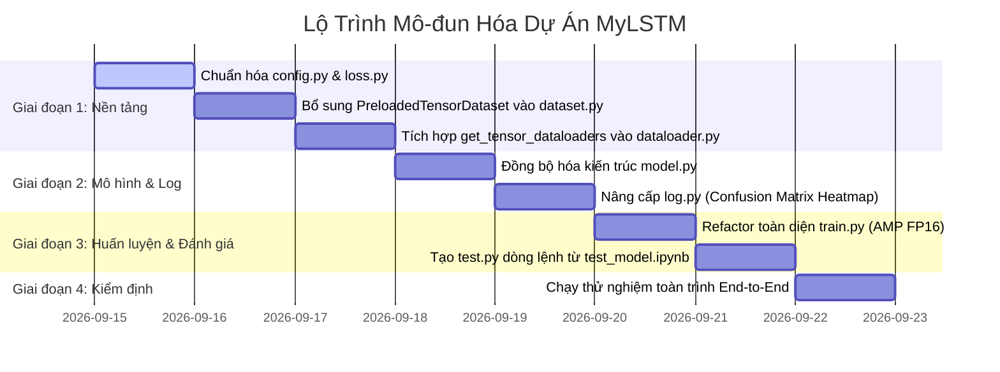

# KẾ HOẠCH MÔ-ĐUN HÓA DỰ ÁN DEEP LSTM (SUST DATASET)
## ÁNH XẠ TOÀN DIỆN CÁC THÀNH PHẦN TỪ `datn4ni2.ipynb` SANG CÁC FILE `.py` TRONG DỰ ÁN

- **Mã kế hoạch:** `KEHOACH-01-REFACTOR`
- **Tài liệu nguồn:** [`datn4ni2.ipynb`](file:///D:/Project/AI/myLSTM/datn4ni2.ipynb) (Notebook huấn luyện tối ưu với PyTorch Tensor `.pt`, AMP FP16 & TensorBoard).
- **Mục tiêu:** Chuyển đổi toàn bộ logic huấn luyện, kiến trúc mô hình, xử lý dữ liệu và giám sát từ dạng Notebook nguyên khối (monolithic) sang kiến trúc mô-đun hóa hướng đối tượng (modular OOP) trên các file Python có sẵn trong project.
- **Yêu cầu cốt lõi:**
  1. **Bảo toàn 100% độ chính xác và tương thích trọng số:** Checkpoint [`best_lstm.pth`](file:///D:/Project/AI/myLSTM/lstm_experiment_results/checkpoints/best_lstm.pth) đã huấn luyện trên notebook phải nạp và chạy suy luận hoàn hảo trên mã nguồn `.py`.
  2. **Tối ưu hóa tốc độ siêu tốc:** Duy trì tốc độ huấn luyện ~1.2s/epoch với GPU CUDA, nạp tensor `.pt` vào RAM < 0.5s và Automatic Mixed Precision (AMP FP16).
  3. **Tương thích ngược hai chiều:** Hỗ trợ song song cả chế độ nạp Tensor `.pt` nhanh (Fast Tensor Mode) lẫn chế độ nạp video thô qua CNN (Legacy Video Mode).

---

## 1. TỔNG QUAN LUỒNG ÁNH XẠ KIẾN TRÚC

Sơ đồ dưới đây mô tả cách 10 Cell trong notebook [`datn4ni2.ipynb`](file:///D:/Project/AI/myLSTM/datn4ni2.ipynb) được phân rã và ánh xạ vào 7 module Python hiện có của dự án:



---

## 2. MA TRẬN ĐỐI CHIẾU & ÁNH XẠ THÀNH PHẦN (MAPPING MATRIX)

| Cell Trong `datn4ni2.ipynb` | Thành Phần Logic / Lớp | File `.py` Đích | Trạng Thái File `.py` Hiện Tại | Kế Hoạch Thay Đổi & Nâng Cấp |
| :--- | :--- | :--- | :--- | :--- |
| **Cell 1** | Thiết lập Seed, UTF-8, kiểm tra CUDA/VRAM | [`config.py`](file:///D:/Project/AI/myLSTM/config.py), [`train.py`](file:///D:/Project/AI/myLSTM/train.py) | Đã có seed cơ bản | Chuẩn hóa hàm `seed_everything(seed)` dùng chung, cấu hình bộ nhớ PyTorch CUDA |
| **Cell 2** | `KaggleTensorConfig`: đường dẫn `.pt`, siêu tham số (Epoch 40, Batch 64, lr 1e-3, seq_len 120, AMP) | [`config.py`](file:///D:/Project/AI/myLSTM/config.py) | Có `TrainConfig` cũ (cho video thô, seq_len 60, batch 4) | Mở rộng `TrainConfig` hỗ trợ trường `.pt`, thêm preset `TensorTrainConfig` tự động nhận diện Kaggle/Local |
| **Cell 3** | `TensorBoardLogger`: ghi log batch, epoch, custom metrics, confusion matrix heatmap, computational graph | [`log.py`](file:///D:/Project/AI/myLSTM/log.py) | Đã có class `TensorBoardLogger` cơ bản | Bổ sung `log_confusion_matrix()`, `log_metrics()`, cập nhật `log_model_graph()` hỗ trợ input tuple `(p3, p4, p5)` |
| **Cell 4** | `%tensorboard --logdir` | [`train.py`](file:///D:/Project/AI/myLSTM/train.py) / CLI | Chưa có | Thêm hướng dẫn khởi động TensorBoard qua CLI và in link web |
| **Cell 5** | `SpatialFeatureAdapter` (1312 $\rightarrow$ 256) + `DeepLSTMClassifier` (3 layers, 256 units, FC 2 classes) | [`model.py`](file:///D:/Project/AI/myLSTM/model.py) | Đã có, nhưng projection thiếu LayerNorm và FC thiếu Dropout | Chuẩn hóa kiến trúc khớp 100% với checkpoint `best_lstm.pth`, hỗ trợ cả 2 chế độ nạp checkpoint tự động |
| **Cell 6** | `PreloadedTensorDataset`: nạp tensor `.pt` vào RAM trong < 0.5s, DataLoader batch 64 | [`dataset.py`](file:///D:/Project/AI/myLSTM/dataset.py), [`dataloader.py`](file:///D:/Project/AI/myLSTM/dataloader.py) | Chỉ có `MyLSTMDataset` đọc OpenCV video thô | Bổ sung `PreloadedTensorDataset` vào `dataset.py`, thêm hàm factory `get_tensor_dataloaders()` vào `dataloader.py` |
| **Cell 7** | `DrowsinessLoss` (CrossEntropy trên chuỗi/frame cuối), AdamW, CosineAnnealingLR, AMP FP16, Vòng lặp Train/Val | [`loss.py`](file:///D:/Project/AI/myLSTM/loss.py), [`train.py`](file:///D:/Project/AI/myLSTM/train.py) | `loss.py` chỉ có `BCELoss`; `train.py` chưa có AMP và chạy chậm | Bổ sung `DrowsinessLoss` vào `loss.py`; Refactor toàn diện `train.py` với AMP FP16, Gradient Clipping, Cosine LR và lưu checkpoint |
| **Cell 8** | Trực quan hóa đường cong Loss/Acc/F1, đánh giá Best Model Checkpoint với Confusion Matrix | [`train.py`](file:///D:/Project/AI/myLSTM/train.py), [`test.py`](file:///D:/Project/AI/myLSTM/test_model.ipynb) | Chưa có module đánh giá chuyên sâu độc lập | Tích hợp engine đánh giá vào cuối quá trình train và tạo script `test.py` kế thừa từ `test_model.ipynb` |
| **Cell 9** | Đóng gói tự động `temp/lstm_experiment_results.zip` | [`train.py`](file:///D:/Project/AI/myLSTM/train.py) | Chưa có | Bổ sung hàm tiện ích `export_experiment_results()` tự động nén `runs/` và `checkpoints/` |

---

## 3. KẾ HOẠCH CHI TIẾT TỪNG FILE `.py`

### 3.1. File [`config.py`](file:///D:/Project/AI/myLSTM/config.py) (Hệ Thống Cấu Hình Trung Tâm)

#### Hiện trạng:
* Đang định nghĩa `TrainConfig` phục vụ cho việc đọc trực tiếp video từ `VBDDD-dataset`, `seq_len=60`, `batch_size=4`, `epochs=10`, `loss_type="bce"`, chưa có cấu hình cho các tệp tensor nhị phân `.pt`.

#### Các thay đổi cần thực hiện:
1. **Bổ sung nhóm tham số cấu hình Tensor `.pt`:**
   * `use_preloaded_pt: bool = True`: Cờ chuyển đổi giữa nạp Tensor `.pt` (nhanh) và nạp Video thô (chậm).
   * `train_pt: str = "extracted_features_pt/features_sust_train.pt"`: Đường dẫn tensor huấn luyện.
   * `val_pt: str = "extracted_features_pt/features_sust_val.pt"`: Đường dẫn tensor kiểm định.
   * `is_kaggle: bool = os.path.exists("/kaggle")`: Tự động nhận diện môi trường Kaggle để chuyển sang đường dẫn `/kaggle/input/...`.
2. **Cập nhật siêu tham số tối ưu từ `datn4ni2.ipynb`:**
   * `seq_len: int = 120` (chuẩn hóa độ dài chuỗi SUST dataset).
   * `batch_size: int = 64` (tận dụng bộ nhớ GPU).
   * `epochs: int = 40`.
   * `lr0: float = 1e-3`, `lr_min_factor: float = 0.01` (dành cho Cosine Annealing).
   * `weight_decay: float = 1e-4`, `grad_clip_norm: float = 1.0`.
   * `amp: bool = True` (bật Automatic Mixed Precision FP16 mặc định).
   * `loss_type: str = "ce"` (chuyển sang Cross-Entropy Loss mặc định).
3. **Cập nhật cấu hình mô hình:**
   * `adapter_dropout: float = 0.1`.
   * `dropout: float = 0.2`.
   * `use_norm: bool = True` (bật LayerNorm trong Spatial Adapter và Dropout trong FC head).

---

### 3.2. File [`dataset.py`](file:///D:/Project/AI/myLSTM/dataset.py) (Quản Lý Dữ Liệu)

#### Hiện trạng:
* Chỉ có lớp `MyLSTMDataset` đọc video bằng OpenCV, giải mã từng khung hình trong lúc nạp. Rất chậm khi huấn luyện trên tập lớn (2,074 video).

#### Các thay đổi cần thực hiện:
1. **Bổ sung lớp `PreloadedTensorDataset(Dataset)`:**
   * Nạp trực tiếp toàn bộ dữ liệu từ tệp `.pt` vào RAM qua `torch.load()`.
   * Hỗ trợ tự động ép kiểu sang `torch.float32` để tương thích cả file lưu dạng `float16`.
   * Cung cấp các thuộc tính: `self.p3`, `self.p4`, `self.p5`, `self.labels`, `self.video_ids`.
   * Phương thức `__getitem__(self, idx)` trả về:
     ```python
     return (self.p3[idx], self.p4[idx], self.p5[idx]), self.labels[idx]
     ```
   * Cơ chế tự tạo dữ liệu giả lập (dummy dataset) nếu tệp `.pt` chưa tồn tại để phục vụ kiểm thử nhanh mã nguồn (unit testing).
2. **Giữ nguyên lớp `MyLSTMDataset`:**
   * Đảm bảo tính tương thích ngược khi người dùng muốn đọc trực tiếp video thô mới mà chưa qua bước trích xuất đặc trưng.

---

### 3.3. File [`dataloader.py`](file:///D:/Project/AI/myLSTM/dataloader.py) (Bộ Nạp Dữ Liệu Hiệu Năng Cao)

#### Hiện trạng:
* Chứa `load_cnn_model` và `CNNCollateFn` để chạy mạng CNN trích xuất đặc trưng trong collate_fn.
* Chưa có hàm khởi tạo DataLoader cho `PreloadedTensorDataset`.

#### Các thay đổi cần thực hiện:
1. **Bổ sung hàm `get_tensor_dataloaders(config: TrainConfig) -> Tuple[DataLoader, DataLoader]`:**
   * Khởi tạo `train_dataset = PreloadedTensorDataset(config.train_pt)` và `val_dataset = PreloadedTensorDataset(config.val_pt)`.
   * Thiết lập `DataLoader`:
     * `batch_size = config.batch_size` (64).
     * `shuffle = True` cho Train, `False` cho Val.
     * `pin_memory = True` nếu chạy CUDA.
     * `num_workers = 0` (vì dữ liệu đã nằm hoàn toàn trên RAM nên `num_workers=0` đạt tốc độ tối đa, loại bỏ overhead IPC giữa các tiến trình Python).
2. **Cập nhật hàm tổng thể `get_dataloaders(config)`:**
   * Kiểm tra điều kiện `if config.use_preloaded_pt: return get_tensor_dataloaders(config)`.
   * Nếu `False`, tiếp tục gọi luồng `MyLSTMDataset` cũ.

---

### 3.4. File [`model.py`](file:///D:/Project/AI/myLSTM/model.py) (Kiến Trúc Mô Hình Đồng Bộ)

#### Hiện trạng:
* `SpatialFeatureAdapter` và `DeepLSTMClassifier` đã được viết khá tổng quát nhưng có sự khác biệt nhỏ về cấu trúc LayerNorm và Dropout so với checkpoint `best_lstm.pth` trong `datn4ni2.ipynb`.

#### Các thay đổi cần thực hiện:
1. **Đồng bộ hóa cấu trúc `SpatialFeatureAdapter`:**
   * Khi `fusion == "concat"`:
     ```python
     self.projection = nn.Sequential(
         nn.Linear(self.total_in_channels, out_dim), # [1312, 256]
         nn.LayerNorm(out_dim),                      # LayerNorm(256)
         nn.ReLU(inplace=True)
     )
     ```
   * Đảm bảo tên các sub-layer khớp chuẩn 100% với checkpoint:
     * `spatial_adapter.projection.0.weight` (Linear)
     * `spatial_adapter.projection.1.weight` (LayerNorm)
2. **Đồng bộ hóa cấu trúc `DeepLSTMClassifier`:**
   * Khối FC đầu ra:
     ```python
     self.fc_out = nn.Sequential(
         nn.Dropout(dropout),                        # fc_out.0 (Dropout 0.2)
         nn.Linear(hidden_dim, num_classes)          # fc_out.1 (Linear 256 -> 2)
     )
     ```
   * Phương thức `forward(features, return_sequence=True)`:
     * Chấp nhận `features` dạng tuple/list `(p3, p4, p5)` trực tiếp.
     * Trả về `logits` dạng chuỗi `[B, T, num_classes]` khi `return_sequence=True` hoặc frame cuối `[B, num_classes]` khi `return_sequence=False`.
3. **Cập nhật phương thức `from_checkpoint()`:**
   * Tự động nhận diện cấu hình lưu trong checkpoint `.pth` (`input_dim`, `hidden_dim`, `num_layers`, `num_classes`).
   * Tự động gán `strict=True` để xác thực toàn vẹn không bị thiếu sót bất kỳ trọng số nào.

---

### 3.5. File [`loss.py`](file:///D:/Project/AI/myLSTM/loss.py) (Hàm Mất Mát Chuẩn Hóa)

#### Hiện trạng:
* Chỉ có `DrowsinessBCELoss` (yêu cầu đầu vào là xác suất sau Softmax).
* Trong khi `datn4ni2.ipynb` sử dụng `nn.CrossEntropyLoss` nhận raw logits (ổn định số học hơn nhiều, tránh lỗi vanishing gradient).

#### Các thay đổi cần thực hiện:
1. **Bổ sung lớp `DrowsinessLoss(nn.Module)` (hoặc `DrowsinessCrossEntropyLoss`):**
   * Sử dụng `nn.CrossEntropyLoss(weight=class_weights)`.
   * Xử lý linh hoạt kích thước đầu vào:
     * Nếu `logits.dim() == 3` (`[B, T, C]`): Tự động duỗi phẳng thành `[B * T, C]`, đồng thời mở rộng nhãn `targets` `[B]` thành `[B * T]`.
     * Nếu `logits.dim() == 2` (`[B, C]`): Tính trực tiếp với `targets` `[B]`.
2. **Cập nhật hàm factory `get_loss_function(config)`:**
   * Nếu `config.loss_type.lower() == "ce"` $\rightarrow$ trả về `DrowsinessLoss`.
   * Nếu `config.loss_type.lower() == "bce"` $\rightarrow$ trả về `DrowsinessBCELoss`.

---

### 3.6. File [`log.py`](file:///D:/Project/AI/myLSTM/log.py) (Giám Sát Toàn Diện TensorBoard)

#### Hiện trạng:
* Đã có khung sườn `TensorBoardLogger`, nhưng thiếu hàm vẽ và log ảnh Ma trận nhầm lẫn (Confusion Matrix Heatmap) và log từ điển Metrics.

#### Các thay đổi cần thực hiện:
1. **Bổ sung phương thức `log_confusion_matrix(cm, epoch, class_names)`:**
   * Sử dụng `matplotlib` và `seaborn.heatmap` để vẽ ma trận nhầm lẫn có màu sắc trực quan, hiển thị cả số lượng và tỷ lệ.
   * Đẩy ảnh vào TensorBoard qua `self.writer.add_figure("Images/Confusion_Matrix", fig, epoch)`.
2. **Bổ sung phương thức `log_metrics(metrics: Dict[str, float], epoch: int)`:**
   * Ghi log các chỉ số chuyên sâu: `Precision`, `Recall`, `F1_Score`.
3. **Nâng cấp phương thức `log_model_graph(model, dummy_input)`:**
   * Hỗ trợ truyền vào `dummy_input` là tuple 3 tensor `(p3, p4, p5)` thay vì chỉ 1 tensor đơn lẻ.

---

### 3.7. File [`train.py`](file:///D:/Project/AI/myLSTM/train.py) (Trình Thực Thi Huấn Luyện Toàn Trình)

#### Hiện trạng:
* Lớp `TrainLstm` đang chạy vòng lặp truyền thống trên FP32, chưa có Automatic Mixed Precision (AMP), chưa có Cosine Annealing LR scheduler hoàn chỉnh, chưa ghi log ma trận nhầm lẫn, và liên kết với DataLoader cũ.

#### Các thay đổi cần thực hiện:
1. **Tích hợp Automatic Mixed Precision (AMP FP16):**
   * Khởi tạo `torch.amp.GradScaler("cuda", enabled=self.config.amp)`.
   * Sử dụng context manager `with torch.amp.autocast("cuda", enabled=self.config.amp):` trong cả vòng lặp Train và Validation.
   * Tăng tốc độ huấn luyện gấp 2 lần và giảm 50% dung lượng VRAM.
2. **Tích hợp Bộ lập lịch Tốc độ học (Learning Rate Scheduler):**
   * Sử dụng `optim.lr_scheduler.CosineAnnealingLR(optimizer, T_max=epochs, eta_min=lr0 * lr_min_factor)`.
   * Cập nhật `scheduler.step()` sau mỗi epoch và ghi nhận giá trị Learning Rate lên TensorBoard.
3. **Tích hợp Cắt tỉa Gradient (Gradient Clipping):**
   * Sử dụng `torch.nn.utils.clip_grad_norm_(model.parameters(), max_norm=cfg.grad_clip_norm)` trước `scaler.step()`.
4. **Theo dõi Chỉ số Đánh giá & Lưu Checkpoint:**
   * Tính toán `precision_score`, `recall_score`, `f1_score` và `confusion_matrix` sau mỗi epoch đánh giá.
   * Tự động so sánh và lưu checkpoint tốt nhất `best_lstm.pth` (kèm epoch, val_acc, f1_score, config).
   * Lưu checkpoint cuối cùng `last_lstm.pth`.
5. **Giao diện dòng lệnh (CLI Execution):**
   * Cho phép chạy file trực tiếp từ terminal với các tham số linh hoạt:
     ```bash
     python train.py --epochs 40 --batch-size 64 --amp --data extracted_features_pt
     ```
6. **Tự động đóng gói kết quả:**
   * Hàm `export_results_zip()` tự động nén `runs/` và `checkpoints/` thành file zip sau khi hoàn tất.

---

### 3.8. Tệp Mới: `test.py` (Script Kiểm Thử Độc Lập Dòng Lệnh)

#### Mục đích:
* Cung cấp công cụ chạy kiểm thử độc lập từ terminal (bổ trợ cho [`test_model.ipynb`](file:///D:/Project/AI/myLSTM/test_model.ipynb)) mà không bắt buộc phải mở Jupyter Notebook.
* Xuất toàn bộ báo cáo JSON, CSV và biểu đồ PNG tương tự như notebook.

---

## 4. QUY TRÌNH DỮ LIỆU & TƯƠNG TÁC GIỮA CÁC MODULE (DATA PIPELINE)

Sơ đồ luồng dữ liệu từ tệp nhị phân `.pt` qua các module trong quá trình huấn luyện:



---

## 5. LỘ TRÌNH TRIỂN KHAI THEO TỪNG BƯỚC (STEP-BY-STEP ROADMAP)



### Chi tiết các bước thực hiện:

#### Bước 1: Chuẩn hóa [`config.py`](file:///D:/Project/AI/myLSTM/config.py) và [`loss.py`](file:///D:/Project/AI/myLSTM/loss.py)
* Cập nhật `TrainConfig` với các tham số tensor `.pt`, AMP, Cosine Scheduler.
* Bổ sung lớp `DrowsinessLoss` trong `loss.py` xử lý Cross-Entropy cho chuỗi 3D hoặc frame cuối 2D.
* Viết khối test `if __name__ == "__main__":` trong `loss.py` để xác minh loss tính toán chính xác.

#### Bước 2: Bổ sung dữ liệu trong [`dataset.py`](file:///D:/Project/AI/myLSTM/dataset.py) và [`dataloader.py`](file:///D:/Project/AI/myLSTM/dataloader.py)
* Thêm lớp `PreloadedTensorDataset` vào `dataset.py`.
* Thêm hàm `get_tensor_dataloaders()` vào `dataloader.py`.
* Kiểm tra tải dữ liệu thực tế từ `extracted_features_pt/features_sust_val.pt` (415 video).

#### Bước 3: Đồng bộ hóa [`model.py`](file:///D:/Project/AI/myLSTM/model.py)
* Kiểm tra và căn chỉnh các layer của `SpatialFeatureAdapter` và `DeepLSTMClassifier`.
* Chạy thử hàm nạp trọng số `from_checkpoint("lstm_experiment_results/checkpoints/best_lstm.pth")`.
* Đảm bảo kiểm tra `torch.equal()` trên output để khẳng định model cho ra kết quả trùng khớp 100% với notebook.

#### Bước 4: Nâng cấp [`log.py`](file:///D:/Project/AI/myLSTM/log.py)
* Thêm phương thức `log_confusion_matrix()` và `log_metrics()`.
* Chạy thử khối test cục bộ của `log.py` để xác nhận file event sinh ra chuẩn trong thư mục `runs/`.

#### Bước 5: Tái cấu trúc [`train.py`](file:///D:/Project/AI/myLSTM/train.py)
* Tích hợp `torch.amp.GradScaler`, `CosineAnnealingLR`, và `Gradient Clipping`.
* Ghép nối các module: `TrainConfig`, `PreloadedTensorDataset`, `DeepLSTMClassifier`, `DrowsinessLoss`, `TensorBoardLogger`.
* Thêm `argparse` cho CLI.

#### Bước 6: Xây dựng [`test.py`](file:///D:/Project/AI/myLSTM/test_model.ipynb) và Kiểm thử Tích Hợp Toàn Trình (E2E Test)
* Chạy 1 epoch thử nghiệm trên `train.py` để đo thời gian, bộ nhớ VRAM, và tính toàn vẹn của checkpoint mới sinh ra.
* Chạy kiểm thử trên checkpoint đã lưu bằng `test.py` và so sánh đối chiếu với kết quả trong `test_model.ipynb`.

---

## 6. TIÊU CHÍ NGHIỆM THU (ACCEPTANCE CRITERIA)

| Hạng mục kiểm định | Tiêu chí đạt chuẩn | Phương pháp xác minh |
| :--- | :--- | :--- |
| **1. Tính toàn vẹn trọng số (Weights Compatibility)** | `model.py` nạp file `best_lstm.pth` không phát sinh cảnh báo `Missing key` hay `Unexpected key` nào. | Chạy lệnh kiểm tra `model.load_state_dict(ckpt, strict=True)`. |
| **2. Độ tương đồng kết quả (Output Parity)** | Điểm số Accuracy và F1 trên tập validation của `test.py` hoặc `train.py` phải khớp với notebook: **Accuracy ~80.48%**, **F1-Score ~0.7840**. | So sánh bảng báo cáo giữa `test_evaluation_report.json` và log train. |
| **3. Tốc độ huấn luyện (Training Speed)** | Tốc độ trên GPU Nvidia đạt **$\le 1.5$ giây / Epoch** khi bật AMP FP16 với `batch_size=64`. | Đo thời gian chạy 5 epochs trên `train.py`. |
| **4. Tốc độ nạp dữ liệu (I/O Latency)** | Nạp toàn bộ 1,659 video train và 415 video val vào RAM trong **$< 1.0$ giây**. | Đo thời gian thực thi của `PreloadedTensorDataset`. |
| **5. Giám sát TensorBoard** | Thư mục `runs/` sinh ra đầy đủ các biểu đồ: `Train/Batch_Loss`, `Train/Epoch_Accuracy`, `Val/Epoch_Loss`, `Metrics/F1_Score`, `Images/Confusion_Matrix`, và Computational Graph. | Khởi động `tensorboard --logdir runs` và duyệt web UI tại `http://localhost:6006`. |
| **6. Khả năng chạy dòng lệnh (CLI Usability)** | Có thể thực hiện huấn luyện và kiểm thử hoàn chỉnh chỉ bằng các lệnh terminal ngắn gọn: `python train.py` và `python test.py`. | Chạy lệnh trực tiếp từ Powershell / CMD. |

---

## 7. TỔNG KẾT

Bản kế hoạch `kehoach1.md` này thiết lập lộ trình rõ ràng, logic và có tính khả thi cao nhất để đưa toàn bộ thành quả nghiên cứu tối ưu từ notebook [`datn4ni2.ipynb`](file:///D:/Project/AI/myLSTM/datn4ni2.ipynb) trở thành một hệ thống mã nguồn Python chuyên nghiệp, sẵn sàng đóng gói, mở rộng và báo cáo trong đồ án tốt nghiệp.
