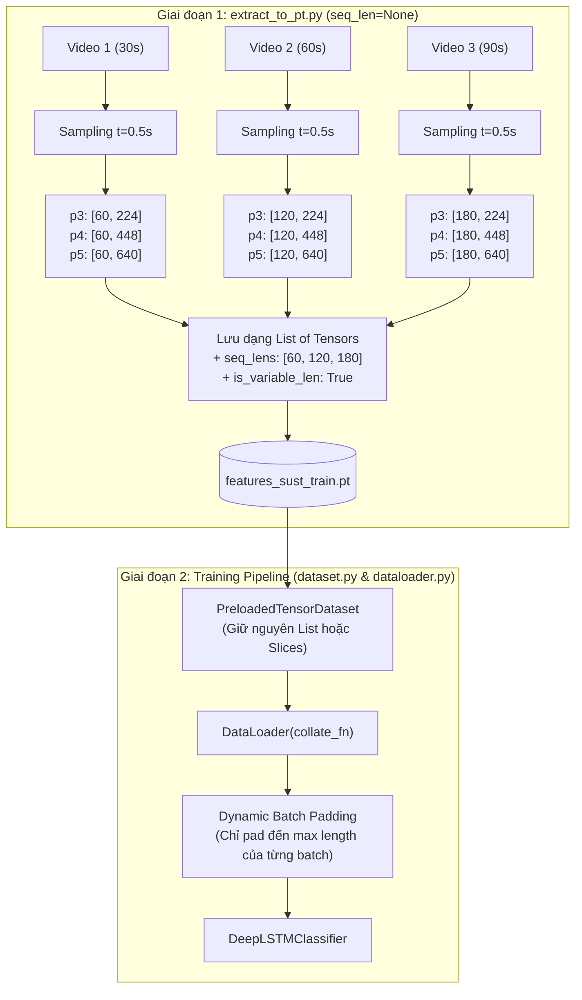

# KẾ HOẠCH NÂNG CẤP VÀ ĐỒNG BỘ `extract_to_pt.py` THEO `MyLSTMDataset` VÀ CƠ CHẾ `List[torch.Tensor]`

---

## 1. TỔNG QUAN & BỐI CẢNH MỚI

### 1.1. Bối cảnh
Trong hệ thống nhận diện tài xế buồn ngủ (Driver Drowsiness Detection), quy trình xử lý dữ liệu được chia làm hai giai đoạn:
1. **Giai đoạn 1 (Offline Feature Extraction)**: Trích xuất đặc trưng không gian từ video gốc qua mô hình PAFPN CNN (`clone.onnx`) thành các tệp nhị phân PyTorch Tensor (`features_sust_train.pt`, `features_sust_val.pt`) qua file [extract_to_pt.py](file:///D:/Project/AI/myLSTM/extract_to_pt.py).
2. **Giai đoạn 2 (Temporal Sequence Modeling)**: Huấn luyện mô hình Deep LSTM trên các tensor đã trích xuất qua [dataset.py](file:///D:/Project/AI/myLSTM/dataset.py) (`PreloadedTensorDataset`) và [datn4ni2.ipynb](file:///D:/Project/AI/myLSTM/datn4ni2.ipynb), hoặc huấn luyện trực tiếp từ video thô (Legacy Online Mode) qua lớp [`MyLSTMDataset`](file:///D:/Project/AI/myLSTM/dataset.py#L65-L245).

### 1.2. Vấn đề cốt lõi với thông số `seq_len = None`
Trong [config.py](file:///D:/Project/AI/myLSTM/config.py#L22) và [`MyLSTMDataset`](file:///D:/Project/AI/myLSTM/dataset.py#L83), thông số **`seq_len` mặc định là `None`**.
Điều này mang ý nghĩa thiết kế rất quan trọng:
* **Bảo toàn thời gian thực**: Video được lấy mẫu theo chu kỳ cố định $t$ (`sample_interval = 0.5s`, tức cứ mỗi $0.5$ giây lấy 1 khung hình qua `frame_step = sample_interval * fps`).
* **Độ dài chuỗi tự nhiên ($T_i$)**: Vì `seq_len = None`, các video có thời lượng khác nhau sẽ có số lượng khung hình trích xuất được khác nhau:
  * Video $30$ giây $\to T_1 = 60$ khung hình (Tensor: `[60, C]`).
  * Video $60$ giây $\to T_2 = 120$ khung hình (Tensor: `[120, C]`).
  * Video $90$ giây $\to T_3 = 180$ khung hình (Tensor: `[180, C]`).
* **Sự cố của `extract_to_pt.py` hiện tại**:
  * Code cũ đang sử dụng `torch.stack(p3_all, dim=0)` để ép tất cả video thành một Tensor 3D chữ nhật `[N, T, C]`.
  * Khi $T_i$ biến thiên ($T_1 \neq T_2 \neq T_3$), lệnh `torch.stack` **chắc chắn ném ra lỗi**:
    ```text
    RuntimeError: stack expects each tensor to be equal size, but got [60, 224] at entry 0 and [120, 224] at entry 1
    ```
  * Đồng thời, code cũ lại dùng `torch.linspace` chia đều 120 frame trên toàn video, làm biến dạng hoàn toàn tốc độ thời gian của hành vi chớp mắt và ngáp ngủ.

### 1.3. Định hướng giải pháp: Áp dụng "Cách 1: `List[torch.Tensor]`"
* Khi `seq_len = None`: Lưu các đặc trưng không gian dưới dạng **Danh sách các Tensor (`List[torch.Tensor]`)** bên trong tệp `.pt`. Mỗi video giữ nguyên độ dài thực tế $T_i$, kèm mảng `seq_lens` và cờ `is_variable_len: True`.
* Không chèn bất kỳ khung hình đệm (padding) tĩnh nào vào tệp lưu trữ, giúp tiết kiệm $100\%$ dung lượng ổ đĩa và RAM.
* Khi huấn luyện, việc đồng bộ độ dài được chuyển cho `collate_fn` trong DataLoader xử lý bằng **Dynamic Batch Padding** (`torch.nn.utils.rnn.pad_sequence` theo từng batch).
* Nếu người dùng truyền giá trị cố định qua CLI (ví dụ `--seq_len 120`), hệ thống sẽ tự động pad/clip về 120 và đóng gói thành Tensor 3D chữ nhật chuẩn `[N, 120, C]` như cũ để tương thích ngược tuyệt đối.

---

## 2. BẢNG PHÂN TÍCH SO SÁNH (GAP ANALYSIS)

| Tiêu chí | `MyLSTMDataset` trong `dataset.py` | `extract_to_pt.py` hiện tại | Giải pháp chuẩn hóa (Cách 1) |
| :--- | :--- | :--- | :--- |
| **Giá trị `seq_len`** | Mặc định là `None` (không giới hạn độ dài chuỗi). | Ép buộc cố định `seq_len = 120`. | **Mặc định `seq_len = None`** từ `TrainConfig`, hỗ trợ nhận `None` hoặc số nguyên từ CLI. |
| **Lấy mẫu thời gian** | Cố định theo $t$ (`sample_interval = 0.5s`): `idx = k * (sample_interval * fps)`. | Chia đều toàn video bằng `torch.linspace`. | Đồng bộ 100% thuật toán lấy mẫu theo chu kỳ $t$ và FPS thực tế của `MyLSTMDataset`. |
| **Xử lý độ dài chuỗi** | Nếu `seq_len is None`: giữ nguyên toàn bộ $T_i$ frame. Nếu `seq_len` có giá trị: pad frame cuối. | Ép linspace về đúng 120 frame bất kể thời lượng. | **Khi `seq_len is None`**: Giữ nguyên $T_i$ frame không padding.<br>**Khi `seq_len = 120`**: Pad frame cuối nếu thiếu. |
| **Cấu trúc lưu `.pt`** | Nạp qua `PreloadedTensorDataset`. | Ép `torch.stack` thành Tensor 3D `[N, 120, C]`. | **Khi `seq_len is None`**: Lưu `List[torch.Tensor]` cho $p_3, p_4, p_5$ kèm mảng `seq_lens: Tensor [N]`.<br>**Khi `seq_len` cố định**: Lưu Tensor 3D `torch.stack`. |
| **Dung lượng & Bộ nhớ** | Tối ưu, chỉ lưu dữ liệu thực. | Lãng phí dung lượng cho các video ngắn nếu pad tĩnh. | **Tối ưu 100%**, không tốn bộ nhớ lưu trữ các frame padding. |
| **Quy tắc gán nhãn** | `parts = stem.split('-')`, lấy `parts[-2]`: `"driving" -> 0`, `"drowsiness" -> 1`. | Kiểm tra `parts[-2]` kết hợp tìm chuỗi con heuristic. | Đồng bộ với logic chuẩn của `MyLSTMDataset`, giữ lại heuristic làm fallback an toàn. |
| **Phân chia Train/Val** | `split_by_subject: bool = True` trong `TrainConfig`. | Chỉ chia `Stratified Split` ngẫu nhiên theo video. | Bổ sung **Subject-Independent Split** (chia theo người lái xe) chống Data Leakage. |

---

## 3. THIẾT KẾ KIẾN TRÚC LƯU TRỮ VÀ HUẤN LUYỆN (CÁCH 1)

### 3.1. Sơ đồ luồng dữ liệu hai giai đoạn



### 3.2. Cấu trúc tệp nhị phân `.pt` khi áp dụng Cách 1
```python
# Cấu trúc tệp features_sust_train.pt / features_sust_val.pt
{
    # Khi seq_len is None (Cách 1):
    "p3": [tensor_shape_[60, 224], tensor_shape_[120, 224], tensor_shape_[180, 224], ...], # List[torch.Tensor]
    "p4": [tensor_shape_[60, 448], tensor_shape_[120, 448], tensor_shape_[180, 448], ...], # List[torch.Tensor]
    "p5": [tensor_shape_[60, 640], tensor_shape_[120, 640], tensor_shape_[180, 640], ...], # List[torch.Tensor]

    # Thông tin nhãn và định danh
    "labels": torch.tensor([0, 1, 0, ...], dtype=torch.long),   # Tensor [N]
    "video_ids": ["sust-n_82", "sust-d_1", ...],               # List[str]
    "seq_lens": torch.tensor([60, 120, 180, ...], dtype=torch.int32), # Tensor [N] - Số frame thực tế từng video

    # Metadata cấu hình
    "is_variable_len": True,                                   # Đánh dấu dữ liệu chuỗi động
    "sample_interval": 0.5,                                    # Chu kỳ lấy mẫu t = 0.5s
    "dtype": "float32",                                        # Kiểu dữ liệu tensor
    "split_by_subject": True,                                  # Chế độ chia dữ liệu
    "created_at": "2026-09-24 17:30:00"
}
```

---

## 4. KẾ HOẠCH TRIỂN KHAI TỪNG BƯỚC CHI TIẾT

### Bước 1: Đồng bộ cấu hình mặc định từ `TrainConfig`
* **Mục tiêu**: Nạp `seq_len = None` và `sample_interval = 0.5` trực tiếp từ [config.py](file:///D:/Project/AI/myLSTM/config.py).
* **Chi tiết kỹ thuật**:
  * Nhập `TrainConfig` từ `config.py`.
  * Cập nhật `argparse`:
    * `--seq_len`: Kiểu `str` hoặc `int`, mặc định là `None`. Nếu người dùng truyền `"none"`, `"None"` hoặc không chỉ định $\to$ gán `None`. Nếu truyền số nguyên (ví dụ `120`) $\to$ gán `int`.
    * `--sample_interval`: Mặc định lấy từ `TrainConfig.sample_interval` ($0.5$s).
    * `--split_by_subject`: Mặc định lấy từ `TrainConfig.split_by_subject` (`True`).
    * `--data_dir`: Mặc định lấy từ `TrainConfig.dataset_dir`.

### Bước 2: Chuẩn hóa trích xuất nhãn và Subject ID
* **Mục tiêu**: Tách nhãn chính xác theo quy tắc `parts[-2]` của `MyLSTMDataset` và trích xuất `subject_id` để phân chia độc lập.
* **Chi tiết kỹ thuật**:
  * Hàm `extract_video_metadata(video_path: Path) -> Tuple[int, str]`:
    * `parts = video_path.stem.split('-')`
    * Nhãn: `"driving"` $\to 0$, `"drowsiness"` $\to 1$ (kèm fallback heuristic an toàn).
    * Subject: Lấy `parts[1]` nếu là dạng SUST (`sust-d_1-...`), lấy `parts[0]` nếu là VBDDD (`subject0-...`).

### Bước 3: Nâng cấp bộ phân chia Dataset (`prepare_dataset_split`)
* **Mục tiêu**: Hỗ trợ phân chia theo đối tượng người tham gia (**Subject-Independent Split**).
* **Chi tiết kỹ thuật**:
  * Nếu `split_by_subject == True`:
    * Gom nhóm toàn bộ video theo từng `subject_id`.
    * Chia danh sách các `subject_id` độc lập theo tỷ lệ `train_ratio = 0.8`.
    * Gom video của các subject tương ứng vào tập Train và Val. Đảm bảo $100\%$ không có subject nào xuất hiện ở cả hai tập.
  * Nếu `split_by_subject == False`:
    * Thực hiện Stratified Split theo từng video đơn lẻ như cũ.
  * Lưu metadata phân bổ vào `dataset_split.json`.

### Bước 4: Viết lại hàm đọc video theo chu kỳ $t$ và `seq_len` linh hoạt
* **Mục tiêu**: Loại bỏ `torch.linspace`, đồng bộ thuật toán lấy mẫu $t$ cố định của [`MyLSTMDataset._load_video_frames`](file:///D:/Project/AI/myLSTM/dataset.py#L152-L239).
* **Đặc tả logic**:
  1. Đọc `fps` từ video qua `cv2.CAP_PROP_FPS` (fallback 30.0 nếu $\le 0$).
  2. Tính bước nhảy khung hình: `frame_step = max(sample_interval * fps, 1.0)`.
  3. Lập danh sách mốc thời gian $k \times \text{frame\_step}$:
     * Nếu `seq_len is None`: Lấy toàn bộ các khung hình cho đến khi hết video (`idx >= total_frames`).
     * Nếu `seq_len is not None`: Dừng khi số frame đạt `seq_len`.
  4. Đọc các frame tại các index đã chọn, qua `letterbox(rgb, new_size=img_size)`.
  5. Xử lý độ dài:
     * **Nếu `seq_len is None`**: **Không padding**, giữ nguyên số khung hình thực tế $T_i$ của video.
     * **Nếu `seq_len is not None`**: Nếu thiếu frame so với `seq_len`, lặp lại frame cuối (Last-frame padding) cho đến khi đủ `seq_len`.

### Bước 5: Cập nhật hàm xử lý trích xuất & lưu trữ Cache (`process_split_set`)
* **Mục tiêu**: Cache lưu trữ độc lập từng video với shape `[T_i, C]`.
* **Chi tiết kỹ thuật**:
  * Mỗi video lưu 1 file cache `.pt` với shape `p3: [T_i, 224]`, `p4: [T_i, 448]`, `p5: [T_i, 640]`.
  * Lưu kèm `sample_interval`, `seq_len_actual: T_i`, `fps` trong cache.

### Bước 6: Đóng gói Tensor theo Cách 1 (`List[torch.Tensor]`)
* **Mục tiêu**: Đóng gói tệp `.pt` tương thích linh hoạt cho cả `seq_len = None` và `seq_len = int`.
* **Chi tiết kỹ thuật**:
  ```python
  if seq_len is None:
      # CÁCH 1: Giữ nguyên List[torch.Tensor], không dùng torch.stack
      final_p3 = p3_all  # List[Tensor [T_i, 224]]
      final_p4 = p4_all  # List[Tensor [T_i, 448]]
      final_p5 = p5_all  # List[Tensor [T_i, 640]]
      is_variable_len = True
  else:
      # Cố định seq_len: Dùng torch.stack tạo Tensor 3D chữ nhật [N, seq_len, C]
      final_p3 = torch.stack(p3_all, dim=0)
      final_p4 = torch.stack(p4_all, dim=0)
      final_p5 = torch.stack(p5_all, dim=0)
      is_variable_len = False
  ```
  Lưu `save_dict` ra `features_sust_train.pt` và `features_sust_val.pt`.

### Bước 7: Cập nhật `PreloadedTensorDataset` & `collate_fn` trong `dataset.py` và `dataloader.py`
* **Mục tiêu**: Đảm bảo toàn bộ hệ thống huấn luyện nạp và xử lý mượt mà định dạng `List[torch.Tensor]`.
* **Cập nhật trong `PreloadedTensorDataset` ([dataset.py](file:///D:/Project/AI/myLSTM/dataset.py#L14-L64))**:
  * Nếu `data["p3"]` là `list`: Giữ nguyên danh sách các tensor `[T_i, C]`, không ép kiểu `.float()` hàng loạt mà ép kiểu trong `__getitem__`.
  * Nếu `data["p3"]` là `Tensor 3D`: Xử lý như cũ.
* **Cập nhật trong `DataLoader` ([dataloader.py](file:///D:/Project/AI/myLSTM/dataloader.py))**:
  * Khi huấn luyện với `is_variable_len = True`, cung cấp hàm `dynamic_collate_fn`:
    Sử dụng `torch.nn.utils.rnn.pad_sequence` để pad các tensor trong batch về độ dài lớn nhất của chính batch đó ($T_{\text{batch\_max}}$).

---

## 5. THIẾT KẾ MÃ NGUỒN CHI TIẾT (CODE DIFF PREVIEW)

### 5.1. Thiết lập tham số CLI và Defaults
```python
from config import TrainConfig
import math

# Lấy giá trị mặc định từ TrainConfig
DEFAULT_DATA_DIR = TrainConfig.dataset_dir
DEFAULT_SEQ_LEN = getattr(TrainConfig, "seq_len", None)        # Mặc định là None!
DEFAULT_SAMPLE_INTERVAL = getattr(TrainConfig, "sample_interval", 0.5)
DEFAULT_IMAGE_SIZE = TrainConfig.image_size[0]
DEFAULT_VIDEO_EXTS = ",".join(TrainConfig.video_exts)
DEFAULT_SPLIT_BY_SUBJECT = getattr(TrainConfig, "split_by_subject", True)
DEFAULT_TRAIN_RATIO = TrainConfig.train_ratio
```

### 5.2. Hàm đọc khung hình linh hoạt theo `sample_interval` và `seq_len`
```python
def read_and_sample_video_frames(
        video_path: Path,
        seq_len: Optional[int] = None,
        sample_interval: float = 0.5,
        img_size: int = 480
) -> Tuple[List[np.ndarray], int]:
    """
    Đọc video và trích xuất khung hình theo chu kỳ thời gian t cố định (sample_interval),
    đồng bộ 100% với logic của MyLSTMDataset trong dataset.py.
    
    Nếu seq_len is None: Trích xuất toàn bộ video theo chu kỳ t (không padding).
    Nếu seq_len is not None: Cắt hoặc lặp lại frame cuối để chuẩn hóa đúng seq_len.
    """
    cap = cv2.VideoCapture(str(video_path))
    if not cap.isOpened():
        raise RuntimeError(f"Không thể mở video: {video_path}")

    total_frames = int(cap.get(cv2.CAP_PROP_FRAME_COUNT))
    fps = float(cap.get(cv2.CAP_PROP_FPS))
    if fps <= 0 or math.isnan(fps) or math.isinf(fps):
        fps = 30.0

    # Bước nhảy khung hình theo chu kỳ t (0.5s * 30fps = 15 frames)
    frame_step = max(sample_interval * fps, 1.0)

    # 1. Tính danh sách index khung hình theo mốc k * frame_step
    indices = []
    k = 0
    while True:
        idx = int(round(k * frame_step))
        if total_frames > 0 and idx >= total_frames:
            break
        indices.append(idx)
        k += 1
        if seq_len is not None and len(indices) >= seq_len:
            break

    # 2. Đọc khung hình
    frames = []
    for idx in indices:
        cap.set(cv2.CAP_PROP_POS_FRAMES, idx)
        ret, frame = cap.read()
        if ret:
            rgb = cv2.cvtColor(frame, cv2.COLOR_BGR2RGB)
            lb = letterbox(rgb, new_size=img_size)
            frames.append(lb)
        else:
            frames.append(np.zeros((img_size, img_size, 3), dtype=np.uint8))
    cap.release()

    actual_frames = len(frames)

    # 3. Chỉ thực hiện padding nếu seq_len được cấu hình cụ thể
    if seq_len is not None:
        while len(frames) < seq_len:
            frames.append(frames[-1].copy() if len(frames) > 0 else np.zeros((img_size, img_size, 3), dtype=np.uint8))
        frames = frames[:seq_len]

    return frames, actual_frames
```

### 5.3. Đóng gói Tensor theo Cách 1 trong `process_split_set`
```python
    # Đóng gói kết quả tập hợp
    seq_lens_tensor = torch.tensor(seq_lens_all, dtype=torch.int32)
    final_labels = torch.tensor(labels_all, dtype=torch.long)

    if seq_len is None:
        print("[+] Chế độ seq_len=None: Đóng gói theo CÁCH 1 (List of Tensors)...")
        # Giữ nguyên List[torch.Tensor], mỗi phần tử có shape [T_i, C]
        final_p3 = p3_all
        final_p4 = p4_all
        final_p5 = p5_all
        is_var_len = True
    else:
        print(f"[+] Chế độ seq_len={seq_len}: Đóng gói thành Tensor 3D cố định qua torch.stack...")
        final_p3 = torch.stack(p3_all, dim=0)  # [N, seq_len, 224]
        final_p4 = torch.stack(p4_all, dim=0)  # [N, seq_len, 448]
        final_p5 = torch.stack(p5_all, dim=0)  # [N, seq_len, 640]
        is_var_len = False

    if use_fp16:
        if is_var_len:
            final_p3 = [t.half() for t in final_p3]
            final_p4 = [t.half() for t in final_p4]
            final_p5 = [t.half() for t in final_p5]
        else:
            final_p3 = final_p3.half()
            final_p4 = final_p4.half()
            final_p5 = final_p5.half()

    save_dict = {
        "p3": final_p3,
        "p4": final_p4,
        "p5": final_p5,
        "labels": final_labels,
        "video_ids": video_ids_all,
        "seq_lens": seq_lens_tensor,
        "is_variable_len": is_var_len,
        "sample_interval": sample_interval,
        "dtype": "float16" if use_fp16 else "float32",
        "created_at": time.strftime("%Y-%m-%d %H:%M:%S"),
        "augmented": is_augmented_split,
        "num_aug": num_aug if is_augmented_split else 0,
        "include_original": actual_include_original,
    }

    output_pt_path.parent.mkdir(parents=True, exist_ok=True)
    torch.save(save_dict, str(output_pt_path))
```

### 5.4. Đồng bộ trong `PreloadedTensorDataset` ([dataset.py](file:///D:/Project/AI/myLSTM/dataset.py))
```python
class PreloadedTensorDataset(Dataset):
    def __init__(self, pt_path: Union[str, Path], is_train: bool = True):
        super().__init__()
        data = torch.load(str(pt_path), map_location="cpu")
        
        self.is_variable_len = data.get("is_variable_len", isinstance(data["p3"], list))
        
        if self.is_variable_len:
            # Nạp danh sách các tensor có độ dài biến thiên [T_i, C]
            self.p3 = [t.float() for t in data["p3"]]
            self.p4 = [t.float() for t in data["p4"]]
            self.p5 = [t.float() for t in data["p5"]]
        else:
            # Nạp tensor 3D chữ nhật cố định [N, T, C]
            self.p3 = data["p3"].float()
            self.p4 = data["p4"].float()
            self.p5 = data["p5"].float()

        self.labels = data["labels"].long()
        self.video_ids = data.get("video_ids", [f"video_{i:04d}" for i in range(len(self.labels))])
        self.seq_lens = data.get("seq_lens", None)

    def __len__(self) -> int:
        return len(self.labels)

    def __getitem__(self, idx: int):
        return (self.p3[idx], self.p4[idx], self.p5[idx]), self.labels[idx]
```

### 5.5. Dynamic Batch Padding Collate Function ([dataloader.py](file:///D:/Project/AI/myLSTM/dataloader.py))
```python
def dynamic_tensor_collate_fn(batch):
    """
    Collate function tự động pad các chuỗi có độ dài khác nhau về độ dài lớn nhất trong Batch.
    """
    p3_list = [item[0][0] for item in batch]
    p4_list = [item[0][1] for item in batch]
    p5_list = [item[0][2] for item in batch]
    labels  = torch.tensor([item[1] for item in batch], dtype=torch.long)

    # Pad động về max length trong nội bộ batch
    p3_padded = torch.nn.utils.rnn.pad_sequence(p3_list, batch_first=True, padding_value=0.0)
    p4_padded = torch.nn.utils.rnn.pad_sequence(p4_list, batch_first=True, padding_value=0.0)
    p5_padded = torch.nn.utils.rnn.pad_sequence(p5_list, batch_first=True, padding_value=0.0)

    return (p3_padded, p4_padded, p5_padded), labels
```

---

## 6. DANH MỤC KIỂM THỬ XÁC THỰC (VERIFICATION CHECKLIST)

- [ ] **Kiểm tra tham số CLI & Default `seq_len = None`**:
  * Chạy `python extract_to_pt.py --help` xác nhận `--seq_len` có mặc định là `None`.
  * Chạy thử lệnh với `--seq_len None` và xác nhận không bị ép về số nguyên 120.
- [ ] **Kiểm tra cấu trúc tệp `.pt` khi lưu dạng `List[torch.Tensor]`**:
  * Chạy thử với `--limit 4 --seq_len None`.
  * Mở tệp `.pt` và kiểm tra:
    * `isinstance(data["p3"], list) == True`.
    * Mỗi phần tử $i$ trong `data["p3"]` có shape `[T_i, 224]`, trong đó $T_i$ khớp với thời lượng thực tế của video chia cho $0.5$s.
    * `data["is_variable_len"] == True`.
- [ ] **Kiểm tra tính tương thích ngược khi chỉ định `--seq_len 120`**:
  * Chạy thử với `--limit 4 --seq_len 120`.
  * Xác nhận tệp `.pt` được đóng gói thành Tensor 3D `[4, 120, 224]` qua `torch.stack`.
- [ ] **Kiểm tra nạp vào `PreloadedTensorDataset`**:
  * Khởi tạo `PreloadedTensorDataset` trên file `.pt` vừa trích xuất dạng `List[torch.Tensor]`.
  * Truy xuất `sample = ds[0]`, kiểm tra shape của `(p3, p4, p5)`.
- [ ] **Kiểm tra DataLoader với `dynamic_tensor_collate_fn`**:
  * Đưa `PreloadedTensorDataset` vào `DataLoader(batch_size=2, collate_fn=dynamic_tensor_collate_fn)`.
  * Duyệt 1 batch và kiểm tra shape đầu ra của `p3` có đúng dạng `[Batch=2, T_batch_max, 224]`.
- [ ] **Kiểm tra forward pass qua `DeepLSTMClassifier`**:
  * Đưa batch vừa pad qua mô hình Deep LSTM để đảm bảo không gặp lỗi chiều kích thước.

---

## 7. RỦI RO & GIẢI PHÁP PHÒNG NGỪA

| Rủi ro tiềm ẩn | Mức độ | Biện pháp phòng ngừa |
| :--- | :---: | :--- |
| **DataLoader thông thường mặc định dùng `default_collate` sẽ báo lỗi stack khi độ dài khác nhau** | Cao | Cung cấp sẵn hàm `dynamic_tensor_collate_fn` trong `dataloader.py` sử dụng `torch.nn.utils.rnn.pad_sequence` tự động kích hoạt khi `is_variable_len=True`. |
| **Notebook `datn4ni2.ipynb` trên Kaggle đang dùng `DataLoader(train_dataset, batch_size=64)` không truyền `collate_fn`** | Trung bình | Notebook trên Kaggle có thể: (1) truyền flag `--seq_len 120` khi muốn dùng tensor 3D cố định, hoặc (2) thêm `dynamic_tensor_collate_fn` vào Cell 6 của notebook khi dùng chuỗi động. |
| **Video quá dài (hàng nghìn khung hình) gây quá tải VRAM khi gom vào một batch** | Thấp | Trong `extract_to_pt.py`, việc forward ONNX vẫn được chia nhỏ theo `chunk_size = 24`, do đó việc trích xuất hoàn toàn không bị ảnh hưởng bởi độ dài video. Khi huấn luyện, có thể kẹp `max_len` giới hạn trần nếu cần. |
